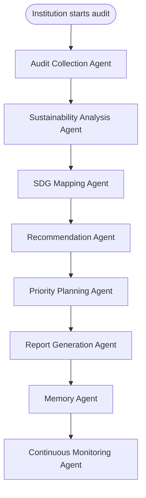

# EcoLens AI: Agentic Sustainability Intelligence Platform

**Professional Sustainability Audit Assistant for Educational Institutions**

[](https://sdgs.un.org/goals/goal12)
[](https://python.org)
[](https://streamlit.io)

> Lenovo LEAP × AICTE Agentic AI Internship

---

## Project Overview

EcoLens AI is an Agentic Sustainability Intelligence Platform designed to help educational institutions evaluate their environmental impact. Instead of relying on manual audits or single-prompt AI generation, EcoLens AI employs a robust **Multi-Agent Architecture** to process data, score practices, map SDGs, and generate tailored action plans.

## Problem Statement

Educational institutions consume significant resources but lack affordable, continuous tools for sustainability auditing. Traditional audits are expensive and infrequent, while basic digital forms lack actionable intelligence. 

## Objectives

- Provide a scalable, automated sustainability audit.
- Utilize an Agentic AI workflow to simulate human auditing experts.
- Deliver actionable, prioritized recommendations and PDF reports.

## Features

- **Agentic AI Architecture**: 8 collaborative agents handling distinct auditing tasks.
- **Sustainability Score** (0–100) with detailed category breakdowns.
- **SDG Mapping**: Automatic alignment with UN Sustainable Development Goals.
- **Agent Insights**: Tailored recommendations ranked by priority and impact.
- **Downloadable PDF report** for stakeholders.

## Agentic AI Architecture

EcoLens AI demonstrates advanced agentic behaviors including planning, reasoning, task decomposition, and memory through the following workflow:


.

## Technology Stack

- **Core**: Python 3.10+
- **Frontend**: Streamlit
- **Intelligence**: OpenAI API (Agent Cognition)
- **Data & Analytics**: Pandas, Plotly
- **Reporting**: FPDF2

## Installation

```bash
git clone <repository-url>
cd ecolens-ai

python -m venv .venv
.venv\Scripts\activate        # Windows
# source .venv/bin/activate   # macOS/Linux

pip install -r requirements.txt

copy .env.example .env        # Windows
# cp .env.example .env        # macOS/Linux
# Set OPENAI_API_KEY for the Agent Orchestrator
```

## Usage

```bash
streamlit run streamlit_app.py
```
Open [http://localhost:8501](http://localhost:8501) in your browser.

## Project Structure

```
ecolens-ai/
├── streamlit_app.py          # Entry point
├── pages/                    # UI Routes
├── ecolens/                  
│   ├── agents/               # Multi-Agent Orchestration
│   ├── audit/                # Core scoring logic
│   ├── analytics/            # Charts
│   ├── reports/              # PDF Engine
│   ├── ui/                   # Theme & components
│   └── config/               # Settings
├── docs/                     # Documentation
└── tests/                    # Unit tests
```

## Future Scope

- Expanding the Continuous Monitoring Agent with predictive analytics.
- Integration of IoT data streams into the Audit Collection Agent.
- Multi-institutional benchmarking via the Memory Agent.

## License

Developed for the Lenovo LEAP × AICTE Agentic AI Internship.
